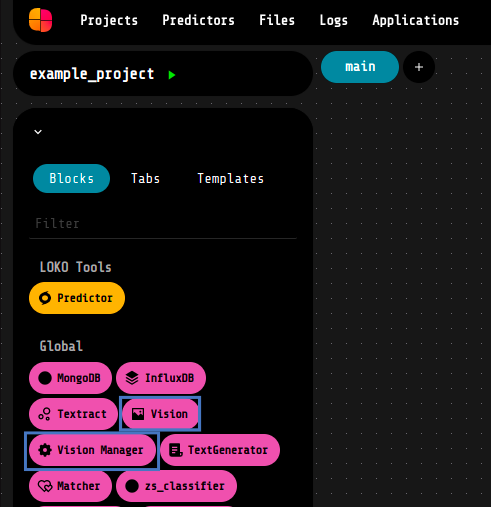
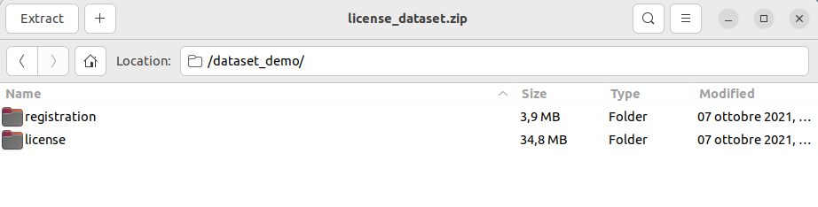
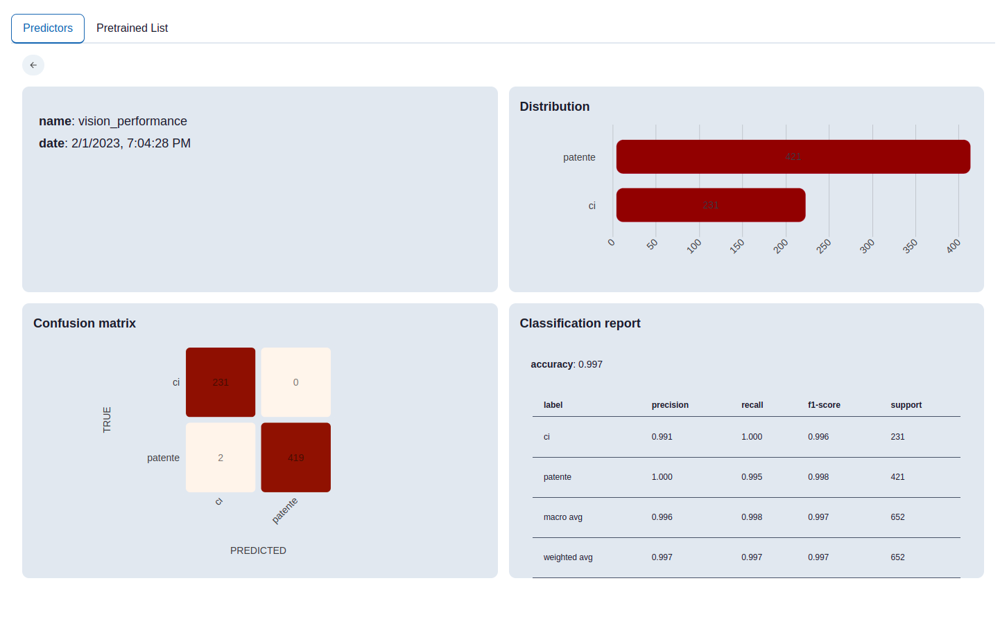
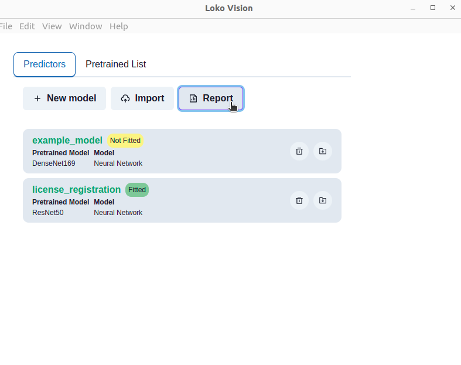

# License Registration Classification

Loko AI project to classify images between "license" documents and "registration" documents, training a Computer Vision customized model by using Transfer Learning technique. Hence, the custom model will be built upon a pre-trained one, chosen among the Keras pretrained list.

To start, from the Projects tab, click on Import from git and copy and paste the URL of the current page (i.e. https:/github.com/loko-ai/license_registration_classification):

1. [_loko-vision_ installation](#vision_installation)
2. [Hands on the project](#hands_on)
3. [Third Example](#third-example)

## :electric_plug: <a name="vision_installation">_loko-vision_ installation</a>

To be able to use the loko-vision components inside your workflows, first of all you need to install this extensions. Here's how:

- **Step 1:** In the top section of the software, click on the "Applications" field. 

- **Step 2:** In the Applications section, you can find the installed extensions and the available ones. Click on the install buttons in order to use the above mentioned components. 

- **Step 3:** Now that you have the extension installed in your local LOKO AI software, you can find the _Vision Manager_ and _Vision_ components in the Blocks list, under the _"Global"_ group as shown in the figure below. 
 

- **Step 4:** to enable these blocks you have to click the play button on the installed applications, then a red square. The first time, it will take some times, because clicking on that button you are launching a Docker container, thus a Docker image will be built. Once the image is built, here you can find also the link to the Vision GUI. 

## :mag_right: <a name="hands_on">Hands on the project </a>

### Step 1

### Transfer Learning

To perform a Transfer Learning over a pretrained model it's required firstly to create the model. Hereby, you can either use the _GUI_ or the _Vision Manager_ component: either way you just have to decide the name, select the pretrained model to use, and eventually choose a tag to facilitate the model identification.

The next step is the model training, which can be easily done by linking a _FileReader_ block to the "fit" input of a Vision block and selecting the model to train. The file to use for training needs to be a .zip file which needs to contains a folder for each label you want to have and each of the folder names' will represent the label name itself. For example, in the image below we have a zip file "license_dataset.zip", and two folder: registration and license. These two names, using this file to train a model, will represent the labels name. 

It's also possible to train a multilabel model: in order to do so, you just have to parse a zip data with nested folder, such as:

- Dog
  - Labrador
  - Corgi
  - Chihuahua
- Cat
  - Bengal
  - Burmese
  - Chartreux

In this case, the model will take as labels all the folders name. When doing the predictions you can choose to use to have multilabel prediction or a classic multiclass. In the second case the labels will reconsidered as: "Dog-Labrador", "Dog-Corgi", "Cat-Bengal", and so on...

Once the training is done, you can use the customized model to make prediction and evaluate the model. To the evaluate input you need to pass necessarily a _.zip_ file, whilst to perform a prediction you can use eitherway a _.zip_ file or a single image (png, jpg, etc...).

Finally, once you have the model evaluation results, you can decide to save in a .eval file. It will always be in a json format, but in this way it will be recognized by the GUI as a possible report file, and you can visualize the model performance, as in the example below.

In order to do so, just open the GUI, click on the Report button (as shown in the following image) and search on your computer for the report you want to visualize.

\

