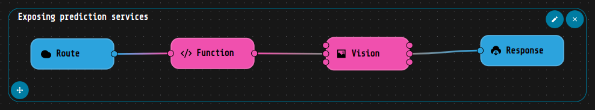

# License Registration Classification

Loko AI project to classify images between "license" documents and "registration" documents, training a Computer Vision customized model by using Transfer Learning technique. Hence, the custom model will be built upon a pre-trained one, chosen among the Keras pretrained list.

To start, from the Projects tab, click on Import from git and copy and paste the URL of the current page (i.e. https:/github.com/loko-ai/license_registration_classification):

1. [_loko-vision_ installation](#vision_installation)
2. [Hands on the project](#hands_on)

## :electric_plug: <a name="vision_installation">_loko-vision_ installation</a>

To be able to use the loko-vision components inside your workflows, first of all you need to install this extensions. Here's how:

- **Step 1:** In the top section of the software, click on the "Applications" field. 

- **Step 2:** In the Applications section, you can find the installed extensions and the available ones. Click on the install buttons in order to use the above mentioned components. 

- **Step 3:** Now that you have the extension installed in your local LOKO AI software, you can find the _Vision Manager_ and _Vision_ components in the Blocks list, under the _"Global"_ group as shown in the figure below. 
 

- **Step 4:** to enable these blocks you have to click the play button on the installed applications, then a red square. The first time, it will take some times, because clicking on that button you are launching a Docker container, thus a Docker image will be built. Once the image is built, here you can find also the link to the Vision GUI. 

## :mag_right: <a name="hands_on">Hands on the project </a>

In order to start the project remember to press the play button on the right of the project's name as shown in the video below, then follow the steps listed afterwards. 

### Step 1: Create the model

To perform a Transfer Learning over a pretrained model it's required firstly to create the model. Hereby, you can either use the _Vision GUI_ or the _Vision Manager_ component: either way you just have to decide the name, select the pretrained model to use, and eventually choose a tag to facilitate the model identification.

In order to create the model using the Vision Manager component, just link a trigger to the "create" input of the named component and don't forget to set the name and the pre-trained model to use. Press the "Run" section of the Trigger component and your model will be created. 

### Step 2: Train the model

The next step is the model training: from a workflow view, it can be easily done by linking a _FileReader_ block to the "fit" input of a Vision block and selecting the model to train, as you can see in the [gif below](#training_gif). As a general rule, the file to use for training needs to be a .zip file, which needs to contains a folder for each label you want to have and each of the folder names' will represent the label name itself. 

In this case, we have a zip file called ["license_dataset.zip"](/home/roberta/loko/projects/license_registration_classification/data/license_dataset.zip) which contains two folder: registration and license, each of these . Thus, using this .zip file to train the custom model we built at the previous step, the labels name will be license and registration, and that's the aim of our model: classify between these two categories the image in input.

Once the "Run" button of the File Reader block is clicked, you will starts seeing message above the Vision block, that will keep you posted about the state of the training. 

### Step 3: Model Evaluation

You can use the Vision component to evaluate the model just trained and obtain a performance report, that you can save and visualize directly using the Vision GUI.

In order to evaluate the model, we start linking a _File Reader_ to the evaluate input of the Vision block: opening this component, in the _Evaluate Parameters_ section select the model you want to evaluate, which in this case will be "license_clf", the model created in the step 1 and trained in the step 2. The file that we need to use in order to evaluate the model must have the same structure seen in the previous step: it must be a .zip file, where the images are grouped in folder, according to their belonging category. In this case, just for demonstrative purpose, we will use the same zipped file used for the training of the model. Here's a gif that shows how to build the workflow:

Running this workflow, you will obtain as output value an object containing several classification metrics, such as accuracy, precision, recall and others. You can see the results of the evaluation on the "licence_dataset.zip" dataset in the [image below](#evaluation_report).

Once these KPIs have been obtained, it is possible to decide whether to create plots or extract insights by manipulating the metrics independently, or to use the **Vision GUI** which provides a pre-built dashboard that displays the key insights of these metrics both numerically and graphically. To accomplish this, you'll need to save the output object from the Vision component to a _File Writer_, specifying the path, file name, and format. While the format parameter should be set to ".json", the file name must have the extension ".eval" for the GUI to interpret it correctly: as you can see in the [gif above](#evaluate_workflow) we choose as path and filename "data/data/license_eval_report.eval". Once the file is saved, you can navigate to the "Applications" section at the top of the screen and click on the link to the Vision GUI extension. From there, you can access the model evaluation report by clicking on the "Report" button and selecting the file you saved. This will display the dashboard with the key insights of the metrics.

### Step 4: Expose Prediction service

Exposing a service in LOKO AI it's a pretty easy and straightforward process. You need to drag-and-drop two components: Route and Response. Route must be placed in the head of the workflow you want to use, Response in the tail. Inside the Route configuration,  it's possible to set the name of the service, in this case we called it predict, and copying the path clicking on the dedicated copy icon, as shown in the [image below](#route_copy), 
you will have the complete url to use this service.

Linking a _Function_ component to the _Route_, we will take the file sent by the request and pass it to the "predict" input of the _Vision_ component. The latter output pin will then be linked to the _Response_ in order to obtain the predicted class for the sumbitted image/s. You can find this workflow and the following one in the "Predict Service" tab.

### Step 5: Test the services

To test this service you can run the following command in your prompt:

'''
curl -X POST http://localhost:9999/routes/orchestrator/endpoints/license_registration_classification/pred_new -F "file=@patente_test.jpg"
'''

consider that you have to run this command being directly in the "resources/data" path, otherwise consider to add the path to "patente_test.jpg", or eventually you can decide to test another image file. Alternatively, it's possible to test the exposed prediction service directly in LOKO AI: you can build a simple workflow, shown in the image below, which reads the image file or even a zipped file using a "File Reader" component and pass it to the HTTP Request component. The latter component's needs to be configured, setting the method as POST and the accept as "json". The URL to use is _http://gateway:8080/routes/orchestrator/endpoints/license_registration_classification/predict_, 
changing the one's copied using the _Route_ component from http://localhost:9999 to http://gateway:8080 since the request will be executed directly in one of the containers inside the loko network.

